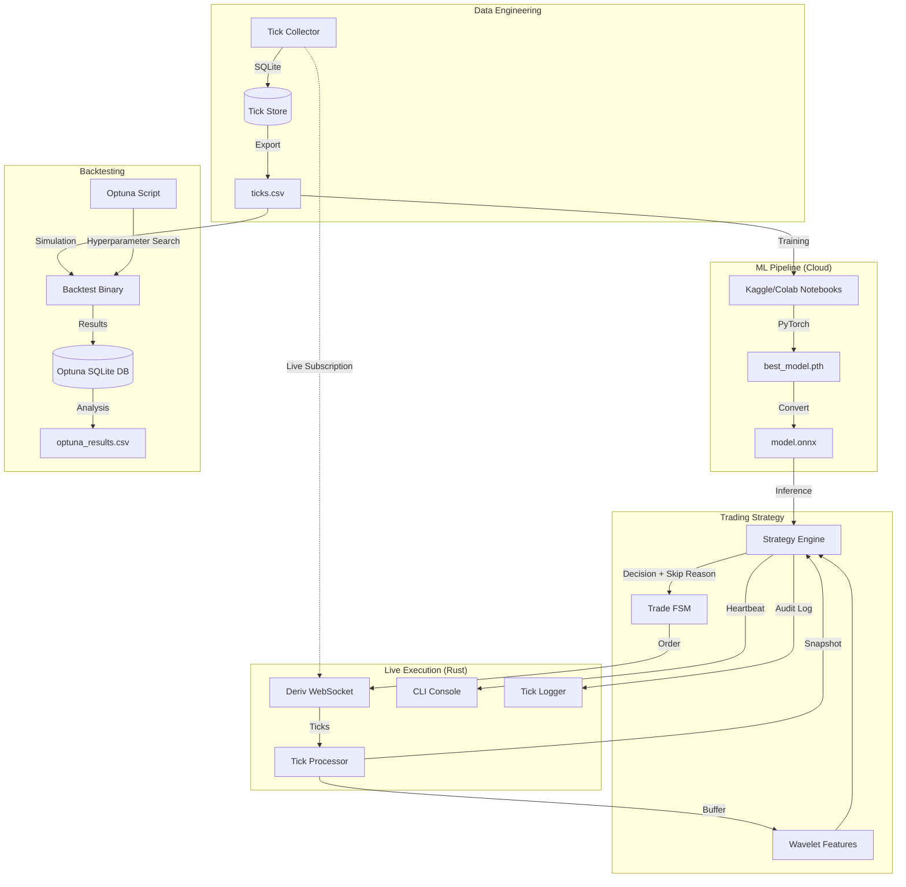

# Project Structure

This document provides a high-level overview of the `hope` repository structure and the relationship between its components.

## File Tree

```text
.
├── AGENTS.md               # Canonical project instructions for AI agents
├── GEMINI.md               # Gemini-specific project instructions
├── Cargo.toml              # Rust project configuration
├── Makefile                # Task runner for common development workflows
├── docs                    # Architectural and operational documentation
│   ├── adr                 # Architectural Decision Records
│   ├── reference           # Local API reference and notes
│   ├── blueprint.md        # Desired system shape and boundaries
│   ├── roadmap.md          # Active development tracker
│   ├── runbook.md          # Operational guide for live trading
│   ├── architecture.md     # Detailed technical architecture
│   └── project_structure.md # This document
├── notebooks               # ML training notebooks (Colab/Kaggle)
├── backtest_optimization   # Persistent storage for Optuna studies
├── scripts                 # Python utilities for data and ML management
│   ├── hope_ml             # Shared ML utility logic
│   ├── tick_collector.py   # Historical and live tick data ingestion
│   ├── export_db.py        # SQLite to CSV/Parquet export tool
│   ├── export_to_onnx.py   # PyTorch to ONNX conversion script
│   ├── grid_backtest.py    # Professional Bayesian Optimization CLI (Optuna)
│   └── sign_model.py       # Model integrity signing tool
├── src                     # Core Rust implementation
│   ├── bin
│   │   └── backtest.rs     # High-fidelity simulation binary
│   ├── config.rs           # Runtime configuration management
│   ├── engine.rs           # Trading engine orchestration and observability
│   ├── execution.rs        # API rate limiting and order execution
│   ├── fsm.rs              # Finite State Machine for trade lifecycle
│   ├── lib.rs              # Library entry point and shared logic
│   ├── main.rs             # Live trading engine entrypoint
│   ├── risk.rs             # Exposure limits and loss protection
│   ├── strategy.rs         # Trading signal generation and skip reason logic
│   ├── tick_logger.rs      # High-fidelity audit logging
│   ├── tick_processor.rs   # Tick data ingestion and feature extraction
│   └── transformer.rs      # ONNX inference for Transformer models
├── tests                   # Integration and unit tests
└── data                    # Market ticks storage (SQLite/CSV)
```

## System Architecture

The following diagram illustrates the data flow and interaction between the system's primary components:



## Component Breakdown

### 1. Market Connectivity (`src/websocket_client.rs`)
Manages the persistent connection to the Deriv API, including authorization, resubscription, and heartbeat handling.

### 2. Deterministic Core (`src/fsm.rs`, `src/engine.rs`)
Ensures that all trade lifecycles follow a strict Finite State Machine. `src/engine.rs` orchestrates the system and provides a **CLI Heartbeat** every 30 ticks to ensure observability when signals are filtered.

### 3. Strategy Engine (`src/strategy.rs`, `src/transformer.rs`)
Combines raw tick data with computed features and model predictions to generate signals. Decisions are enriched with **Skip Reasons** (e.g., "Short Trend", "Low Volatility") to provide context for non-trades.

### 4. Risk & Execution (`src/risk.rs`, `src/execution.rs`)
Enforces multi-layered risk controls (max consecutive losses, exposure limits) and manages API rate limiting to ensure compliant interaction with the Deriv exchange.

### 5. ML Workflow (`scripts/`, `notebooks/`)
A standardized pipeline for collecting data, training noise-resilient models in the cloud, and exporting them back to the Rust environment for inference.

### 6. Backtesting & Optimization (`src/bin/backtest.rs`, `scripts/grid_backtest.py`)
Provides bit-perfect simulation of the live engine. The `grid_backtest.py` script leverages **Optuna** for Bayesian optimization, featuring CLI control, persistence, and Plotly-based observability.

