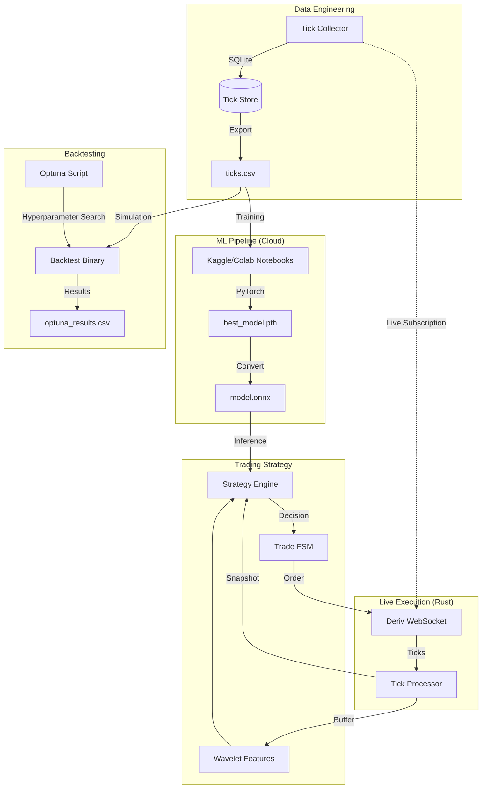

# Project Structure

This document provides a high-level overview of the `hope` repository structure and the relationship between its components.

## File Tree

```text
.
├── AGENTS.md               # Canonical project instructions for AI agents
├── Cargo.toml              # Rust project configuration
├── Makefile                # Task runner for common development workflows
├── docs                    # Architectural and operational documentation
│   ├── adr                 # Architectural Decision Records
│   ├── blueprint.md        # Desired system shape and boundaries
│   ├── roadmap.md          # Active development tracker
│   └── runbook.md          # Operational guide for the live engine
├── notebooks               # ML training notebooks (Colab/Kaggle)
├── scripts                 # Python utilities for data and ML management
│   ├── hope_ml             # Shared ML utility logic
│   ├── tick_collector.py   # Historical and live tick data ingestion
│   ├── export_db.py        # SQLite to CSV/Parquet export tool
│   ├── export_to_onnx.py   # PyTorch to ONNX conversion script
│   └── grid_backtest.py    # Bayesian optimization (Optuna) pipeline
├── src                     # Core Rust implementation
│   ├── lib.rs              # Library entry point and shared logic
│   ├── main.rs             # Live trading engine binary
│   ├── bin
│   │   └── backtest.rs     # High-fidelity simulation binary
│   ├── strategy.rs         # Trading signal generation and model logic
│   ├── fsm.rs              # Finite State Machine for trade lifecycle
│   └── transformer.rs      # ONNX inference for Transformer models
├── tests                   # Integration and unit tests
└── data                    # Local storage for ticks and optimization results
```

## System Architecture

The following diagram illustrates the data flow and interaction between the system's primary components:



## Component Breakdown

### 1. Market Connectivity (`src/websocket_client.rs`)
Manages the persistent connection to the Deriv API, including authorization, resubscription, and heartbeat handling.

### 2. Deterministic Core (`src/fsm.rs`, `src/engine.rs`)
Ensures that all trade lifecycles follow a strict Finite State Machine, preventing overlapping trades and ensuring consistent behavior during disconnects.

### 3. Strategy Engine (`src/strategy.rs`, `src/transformer.rs`)
Combines raw tick data with computed features (Wavelets) and model predictions (Transformer ONNX) to generate entry and exit signals.

### 4. ML Workflow (`scripts/`, `notebooks/`)
A standardized pipeline for collecting data, training noise-resilient models in the cloud, and exporting them back to the Rust environment for inference.

### 5. Backtesting (`src/bin/backtest.rs`, `scripts/grid_backtest.py`)
Provides bit-perfect simulation of the live engine using historical data, enabling rigorous strategy validation and hyperparameter optimization.
